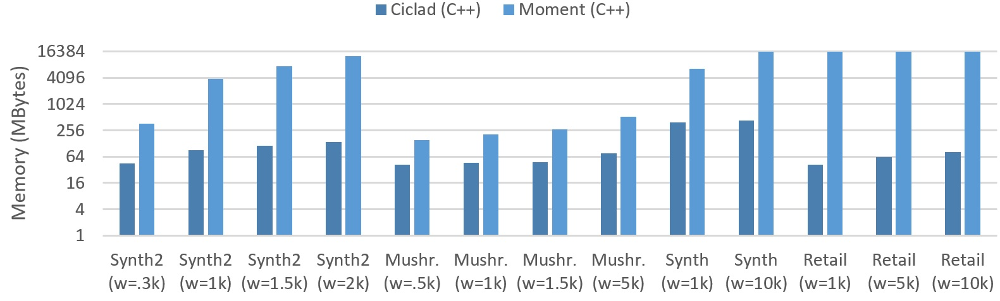

## Experiments in images

#### ... a thousand words maybe more.

### all results dashboard


```
 
```

### Runtime (algorithm & structures)


```
 
```

### Memory usage



```
 
```

### Runtime c++ algorithms


```
 
```

### Runtime for sliding window and support (min_supp)


```
 
```

### Memory usage


```
 
```

### all vs all (batch vs stream algorithms)


---
ciclad :copyright: 2020
